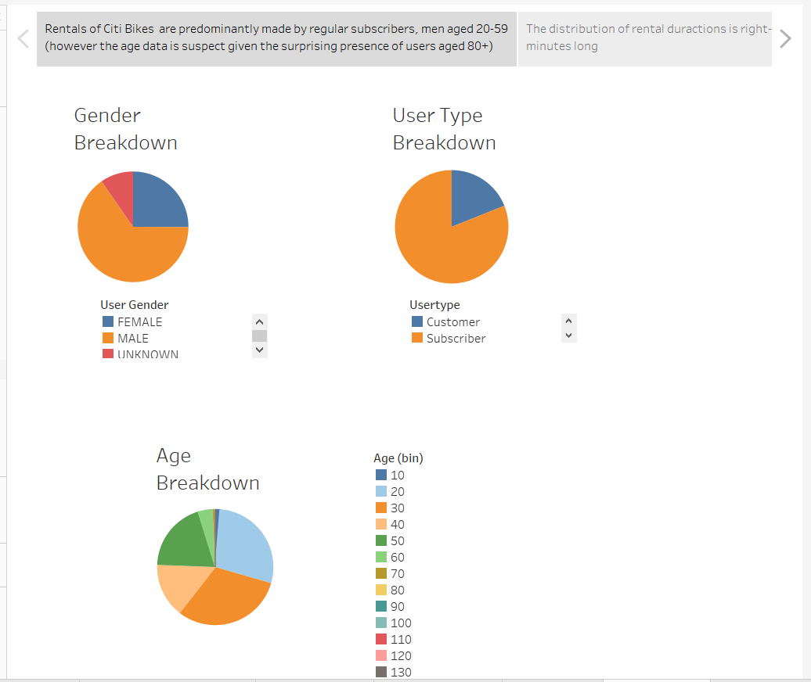
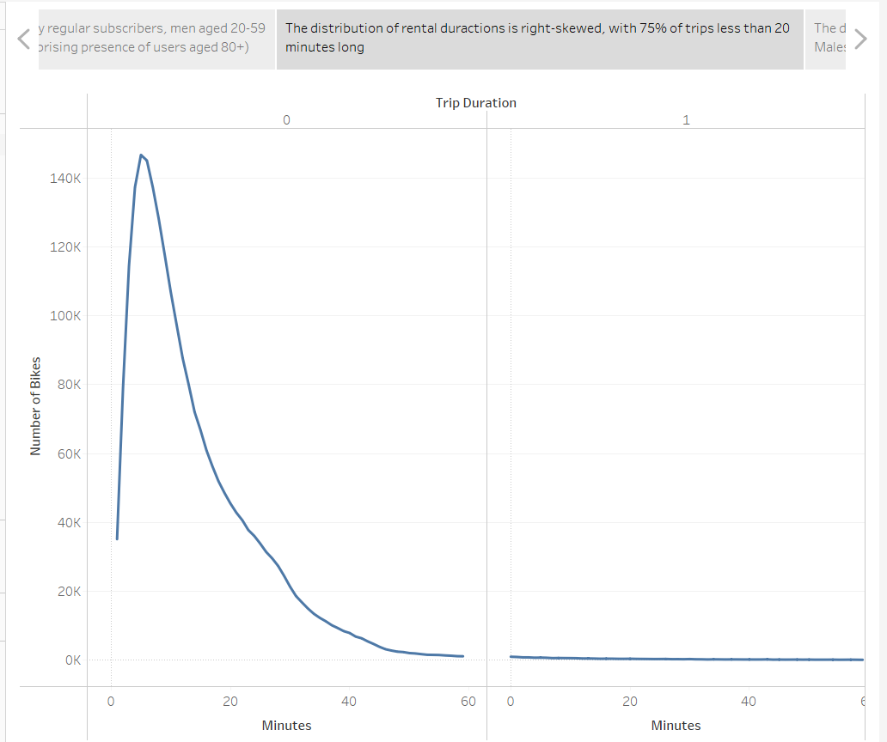
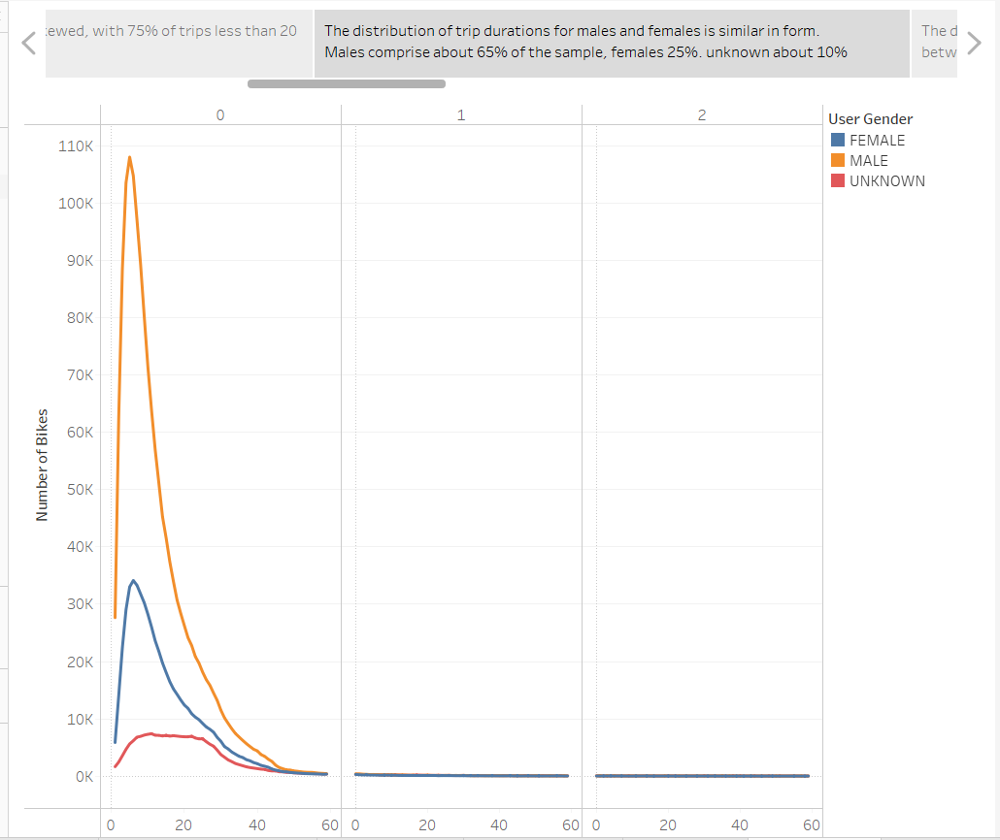
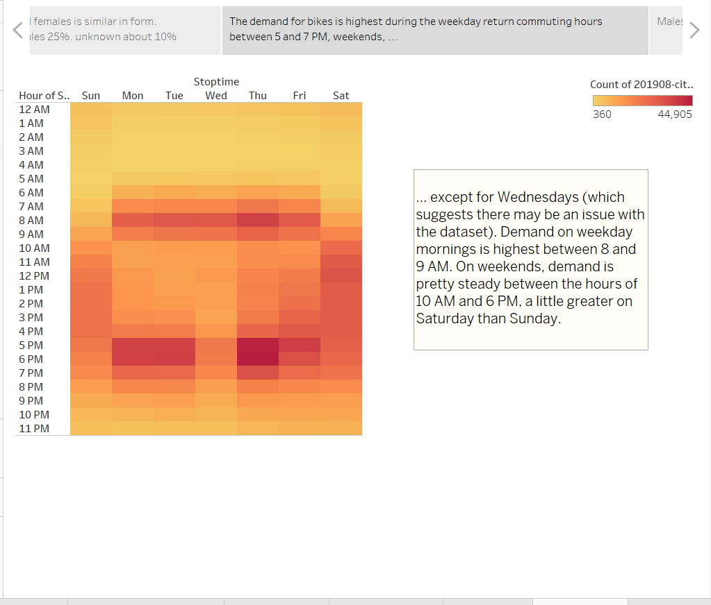
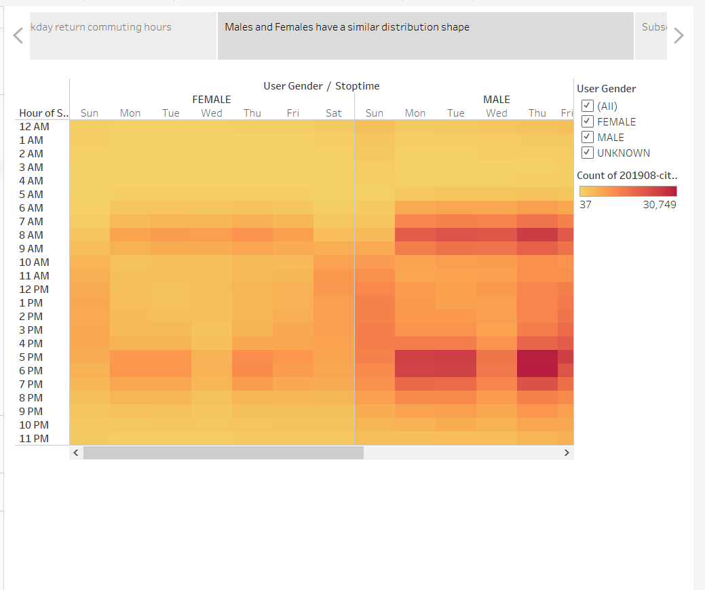
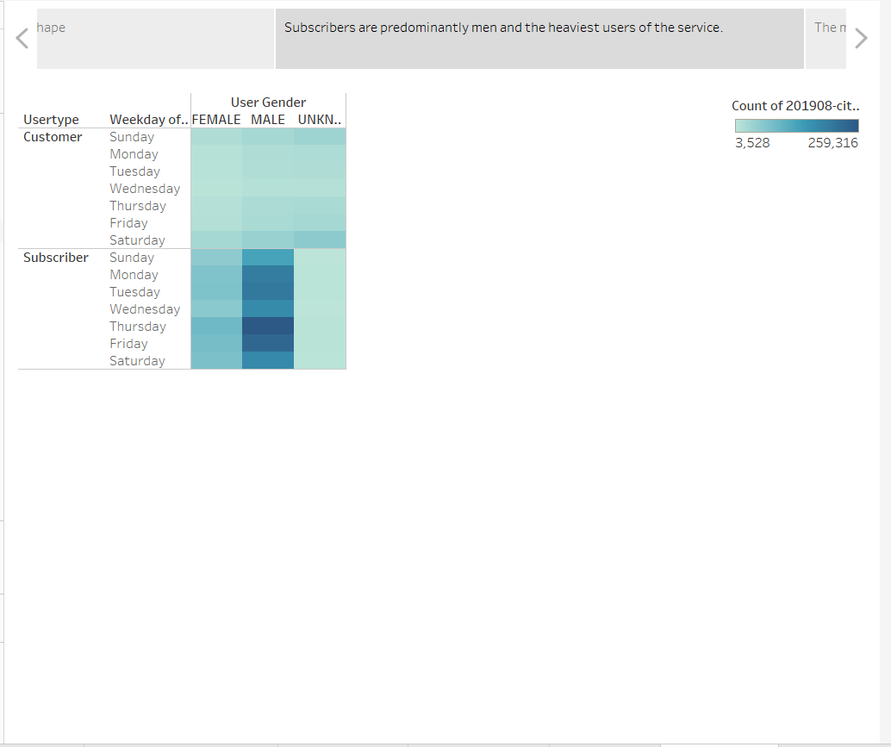
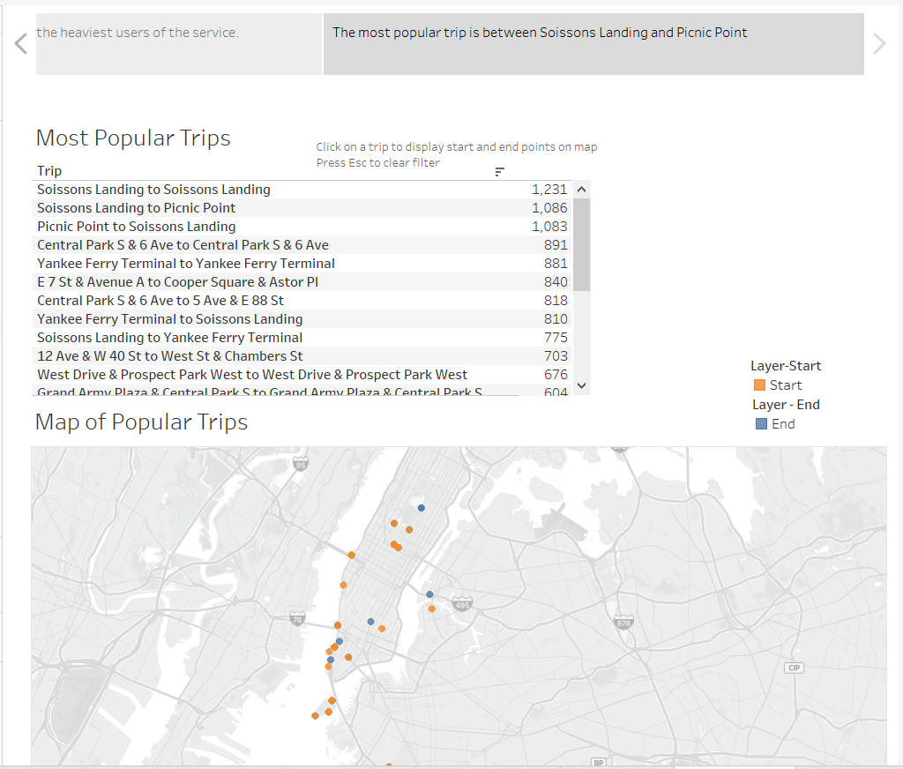

# Tableau and Tableau Public

[link to live dashboard](https://public.tableau.com/app/profile/kathy.morrissey/viz/Module14Challenge_16270642099540/CitiBikesNYC "link to dashboatf")

## Overview

This is an analysis of NYC bike trip data in support of a proposal for a bike sharing program in Des Moines.

The data is from August 2019, and each record represents one bike rental. It is not possible to link individual rentals with a specific customer, so metrics such as repeat usage, heavy vs. light usage, even demographics at a user level are impossible. Thus, this analysis is based on individual rentals from both subscribers and customers (non-subcribers) of the service.

Analysis of the dataset shows issues with the gender field for the customer usertype and birth year field for both user types. These field should be reviewed 

## Results

This image displays the demographics associated with each bike rental. Rentals are predominantly made to men and to subscribers of the service, as opposed to non-subscription rentals.

The distribution of rental durations is right-skewed, with 75% of rentals less than 20 minutes long. The most common duration is 5 minutes.

This image shows the distribution of trip durations for males and females is similar in shape. Males comprise about 65% of the sample, females 25%, unknown about 10%. 

This image shows total rentals by hour, and day of the week using a heat scale. The darker the color, the higher the number of rentals. The demand for bikes is highest during the weekday return commuting hours between 5 and 7 PM, except for Wednesdays (which suggests there may be an issue with the dataset). Demand on weekday mornings is highest between 8 and 9 AM. On weekends, demand is pretty steady between the hours of 10 AM and 6 PM, a little greater on Saturday than Sunday. 

This image shows the same rental data as the above graphic, but broken down by gender. As the earlier charts have shown, the shape of the distribution is similar across gender, but males account for a greater proportion of the rentals than females.

This graphic shows rentals by day of the week, gender and type of user (customer vs. subscriber). The new learning from this graphic is that the rentals with gender "unknown" are primarily from the "customer" user-type. This suggests an issue in the collection of demographic data from customers.

This image shows the 24 most popular trips. In the interactive version of this Tableau image, the user can click on a trip in the top pane, and the starting and ending points of that trip are diplayed on the map. If the strip starts and ends in the same location, only one dot is shown. The most popular trips start and end at Soissons Point, or go between Soissons Point and Picnic Point.

Summary:

More information is needed to apply the results of this analysis to the Des Moines proposal. In particular it will be important to understand commuter vs. tourist rentals. Some of this be be hypothesized based on time and day of the week, the length of the trip and starting/ending points. Commuting vs. tourism could be significantly different in Des Moines, so an analsyis accounting for the differences in these segments will be important.

Spider maps could be used to show trips during commuting vs. non-commuting hours, and week-ends vs. week days.

[link to dashboard](https://public.tableau.com/app/profile/kathy.morrissey/viz/Module14Challenge_16270642099540/CitiBikesNYC "link to dashboatf")
